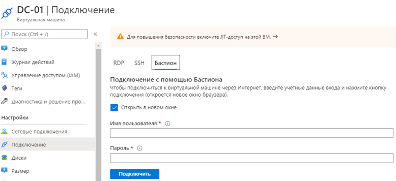

# Инструкция по подключению к платформе проведения квалификационного чемпионата.

## Доступ к порталу
- Откройте браузер и перейдите по адресу https://portal.azure.com
- Авторизуйтесь, используя выданные вам учетные данные
- Система потребует сменить пароль. Сделайте это
- Выберите “Виртуальные машины”

## Доступ к виртуальным машинам
- Выберите виртуальную машину
- Нажмите кнопку “Подключиться”
- В выпадающем меню выберите “Bastion”

- Введите **предоставленные в задании** логин и пароль
- Нажмите кнопку “Подключить”
- Окно доступа к виртуальной машине откроется в новой вкладке
- Доступны опции “буфер обмена” и “полноэкранный режим”
